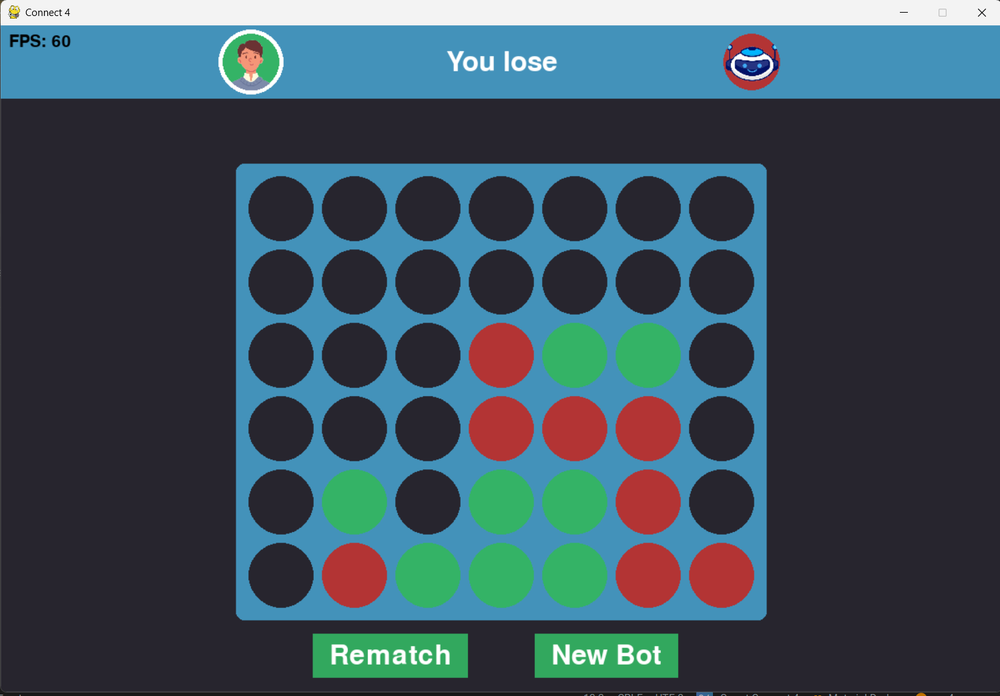

# Smart Connect 4

A single player **Connect 4** game built using **Python**, **Pygame**, and the **Minimax Algorithm** for move evaluation. Features an intelligent bot that evaluates moves ahead to block your wins and secure its own.

 <!-- Replace with actual screenshot path if needed -->

## Features
- Single-player Connect 4 gameplay
- AI opponent powered by a depth-limited minimax algorithm
- Smart move scoring for blocking and winning
- Pygame-powered GUI
- Efficient move searching with alpha-beta optimization and multiprocessing of top-level moves
- Efficient vectorized position scoring using numpy sliding window view array operations to evaluate all 1x4 windows horizontal, vertical and diagonal on the board simultaneously

## Using the project:
### Devs:

- Project files in src folder
- Required packages: numpy, pygame

### Players:

- Download and run game.exe in the dist folder
- Choose a bot difficulty (tip: harder bots take longer to think)
- Have fun

